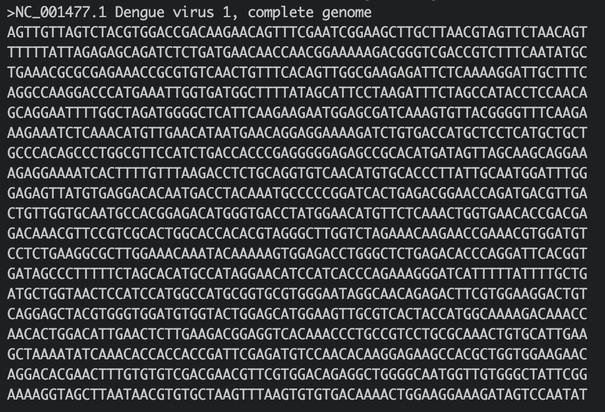
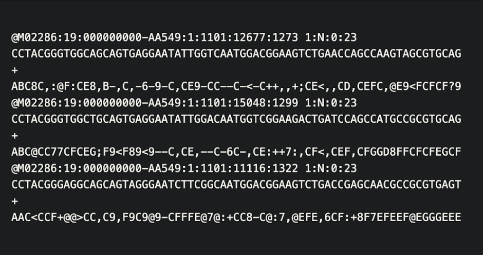
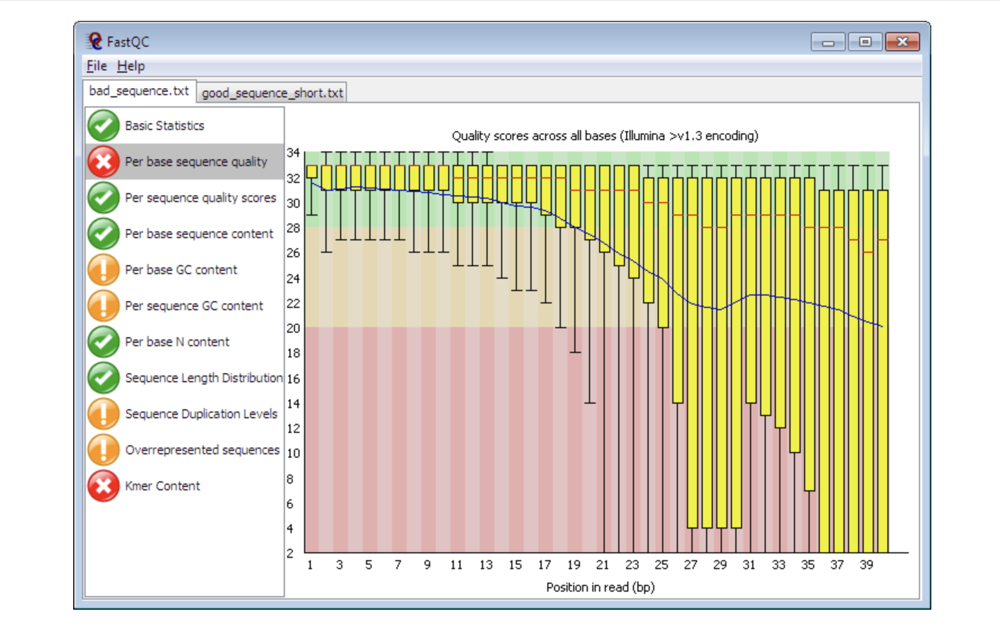
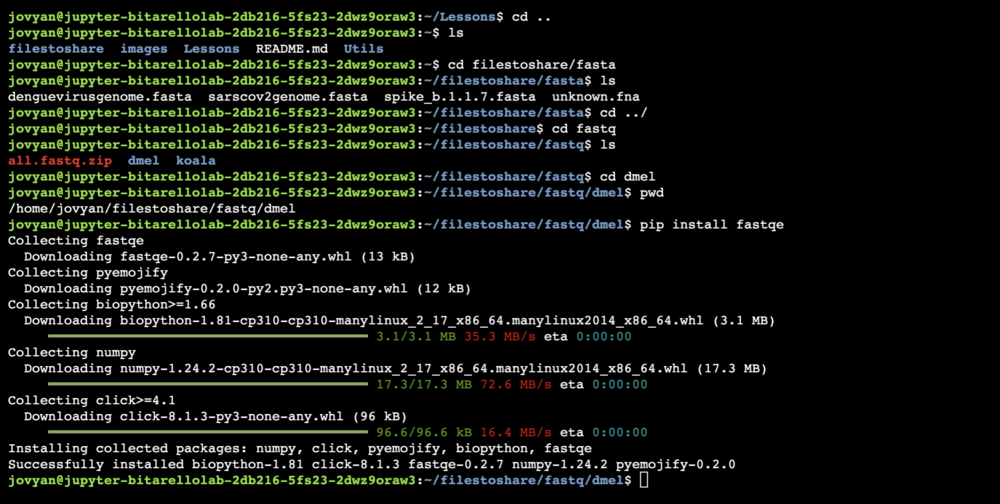

## Goals

* Introduce students to writing basic command line scripts
* Analyze & assess the quality of FASTQ formatted NGS data
* Trim/filter low quality reads in FASTQ files

**FastQC** is a popular software used to provide an overview of basic quality metrics for NGS data. In this lesson, you will use an even more universal form of communication to analyze FASTQ files, THE EMOJI! 

## Background

### FASTQ files

* The 1st step of any Next Generation Sequencing (NGS) analysis pipeline is **checking the quality of the raw sequencing reads** in each FASTQ formatted file. If the sequence quality is poor, then your resulting downstream analysis will be inaccurate and misleading. 


* The name FASTQ comes from FASTA. FASTA is a very populat format to store sequence information (DNA, RNA, proteins).

{width=70%}

* The `Q` refers to "quality". 

* Most sequencing platforms will provide raw reads to the user in this format.


{width=70%}

## The FASTQC software 

* [FastQC](https://www.bioinformatics.babraham.ac.uk/projects/fastqc/) aims to provide a QC report which can spot problems which originate either in the sequencer or in the starting library material. 

{width=70%}

* FastQC can be run in one of two modes: as  a stand-alone interactive application for the immediate analysis of small numbers of FastQ files, or in a non-interactive mode (aka **command line**!) where it would be suitable for integrating into a **larger analysis pipeline** for the systematic processing of large numbers of files.

* Most of the information in this section was taken directly from the FASTQC manual. 

The main functions of FastQC are:

* Import of data from BAM, SAM or FastQ files (any variant)
* Providing a quick overview to tell you in which areas there may be problems
* Summary graphs and tables to quickly assess your data
* Export of results to an HTML based permanent report
* The Basic Statistics module generates some simple composition statistics for the file analyzed:
* Filename: The original filename of the file which was analyzed  
* File type: Says whether the file appeared to contain actual base calls or colorspace data which had to be converted to base calls  
* Encoding: Says which ASCII encoding of quality values was found in this file.  
* Total Sequences: A count of the total number of sequences processed. There are two values reported, actual and estimated. 
* Filtered Sequences: If running in Casava mode sequences flagged to be filtered will be removed from all analyses. The number of such sequences removed will be reported here. The total sequences count above will not include these filtered sequences. 
* Sequence Length: Provides the length of the shortest and longest sequence in the set. If all sequences are the same length only one value is reported. 
 * %GC: The overall %GC of all bases in all sequences
* Tiles: Illumina flowcells are divided into tiles. To see if there is a loss in quality associated with specific parts of the flowcell, FASTQC calculates average quality scores for each tile across all positions in the reads.

### What about FASTQE?

* [FASTQE](https://fastqe.com/) is a program that analyzes FASTQ files & reads out an emoji output as an indicator of the sequence’s quality in the file. So, a high quality read may look like a smily face, while the poop symbol indicates... well you get the idea.

* Like the popular FastQC software, FASTQE can be used to analyze FASTQ file quality whether it’s from a genome sequencing project, an RNA-seq project, a ChIP-seq project, etc. 

* The FASTQE program is limited to short read NGS data of 500bp/read or less.


## The Data we are looking at

* Here’s a brief background on the in-class metagenomics project that Dr. Enke’s Bio 481 Genomics class at James Madison University is collecting data for. Garter snakes excrete sexually dimorphic pheromones to attract a mate. 

* The hypothesis of their experiment is that male and female garter snakes host unique microbial communities in their musk glands that contribute to sexually dimorphic bioengineering of these pheromone molecules.

---


## Let's install fastqe


## Step 1: Install the fastqe software

In your terminal, type:


```{bash, echo=T, eval=F}
pip install fastqe
```




## Step 2: Running fastqe

* Task: Run the fastqe program to generate your emoji fastq report.

* Usage: fastqe [fastq-file] (run the fastqe program. If a wildcard [e.g. *.fastq] is provided, fastqe will run on all the fastq files in the current working directory.

Note: Remember that fastq files are very large, so this command will take ~30 seconds/

First, list what's in this directory:


```{bash, eval=F}
fastqe *fastq
```

**Q12) What are the advantages and disadvantages to using the command fastqe  *.fastq rather than fastqe for each of your files (e.g. fastqe Female2-oral1.fastq ... fastqe Male5-oral1.fastq...) ?**


**Q13) Which one of the three files seems to have lower quality than the others?**


## Step 3: Using the help page


Open the FASTQE help page to view the “optional arguments”, these are all of the options and setting for the program.

To get the help info for fastqe (and many other command line programs) add the --help option to the fastqe program instead of a filename or wildcard (remember to leave a space between fastqe and --help).

```{bash, echo=T, eval=F}
#type your command in your terminal

```
You should see something like this:


Which optional argument will show the version # of FASTQE?

## Step 4. Scale

Add the --scale option to the fastqe command to view the Phred score associated with each emoji in your output. Try this just for the `Male5-oral1.fastq` file (remember to leave a space before you type --scale). This will take a few seconds to run.

```{bash, echo=T, eval=F}
#type your command in your terminal
fastqe Male5-oral1.fastq --scale
```

## Step 5. Quality

The quality, also called phred score, is the probability that the corresponding basecall is incorrect.

Phred scores use a logarithmic scale, and are represented by ASCII characters, mapping to a quality usually going from 0 to 40.


**Q14) Phred score of ≤20 is considered a poor quality base call. How many poor quality base calls are at the 3’ end of this read?**


## Step 6. FASTP

Now let's try a different tool, called fastp. But first, we need to install some pre-req libraries.

Paste into your command line

```{bash, eval=F}
conda config --add channels bioconda
conda config --add channels conda-forge
pip install nodejs
pip install scikit-learn
pip install tensorflow
conda create -n assembly -c conda-forge -c bioconda fastp -y
conda activate assembly

```

FASTP gives a more conventional readout of the .fastq file data. Fastp is similar to the famous FastQC; however, it also has a trimming tool to cut out or filtering the low quality sequences in our file.

Run fastp on the lower quality `Male5-oral1.fastq` file.

```
 Usage (Note: You will need to use all of these elements in your command):

fastp is the name of software that will check the quality of the fastq file
 -i [input.fastq] -i option specifies the input file for fastp
 -o [ouput.fastq] -o option specifies the ouput file for fastp
 --html [ouput.html] --html option specifies the name of the HTML report for fastp
 --json [ouput.json] --json option specifies the name of the JSON report for fastp
```
Write a command using Male5-oral1.fastq as your input and out.Male5-oral1.fastq as your output. Name your --html report Male5-oral1.html and your --json report Male5-oral1.json.

```{base, echo=T, eval=F}
#type your command into your command line

```

You should now have 3 new files in your fastp folder

* .html file (this is your QC report)
* .json file (ignore this for now)
* trimmed fastq file (out.Male5_oral1.fastq)

Click on the fastp.html file in the left sidebar pane inside `filestoshare/fastq/` on the left to examine this report.

**Q15) From the “Summary” data in your HTML fastp report, how many reads are in this FASTQ file before and after filtering?**

---
# Learn More

FASTQE Official Webpage. [https://fastqe.com/](https://fastqe.com/)

FASTP Github Repository. [https://github.com/OpenGene/fastp](https://github.com/OpenGene/fastp)

FASTQ files and Quality Control. [https://datacarpentry.org/wrangling-genomics/02-quality-control/index.html](https://datacarpentry.org/wrangling-genomics/02-quality-control/index.html)

